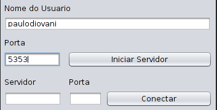
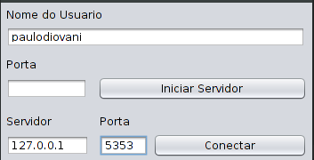
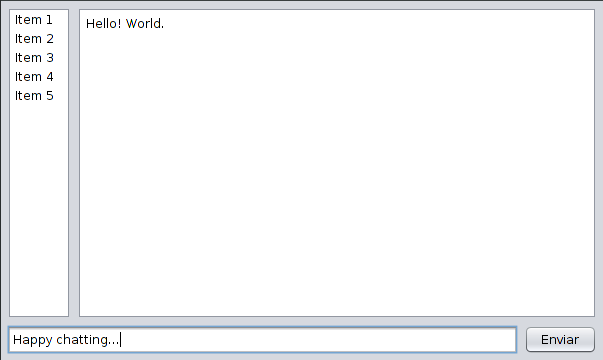

# Multi User Chat Server

Chat application developed for the Distributed Systems discipline at the University Feevale.

Note: Still in early development.

## Usage

- Run the application
- Fill the "Username"
- SERVER MODE
    + Fill the desired "Port" number (must be above 3000)
    + Click on "Start server"

    

- CLIENT MODE
    + Fill the "Host" address to connect
    + Fill "Port" number to connect
    + Click on "Connect"

    

- Write your message and click on "Send"

    

